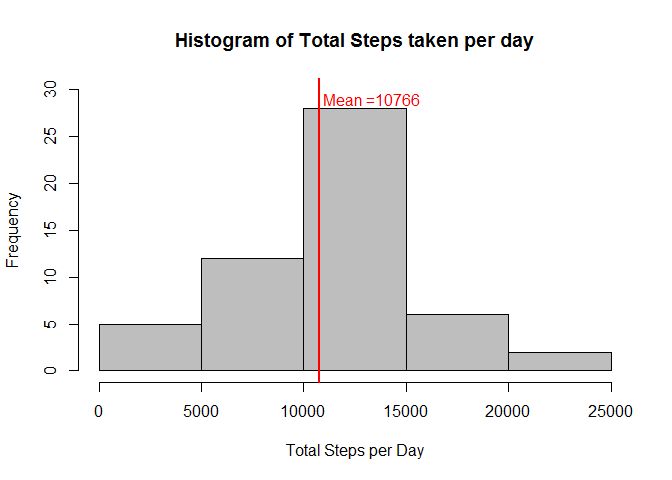
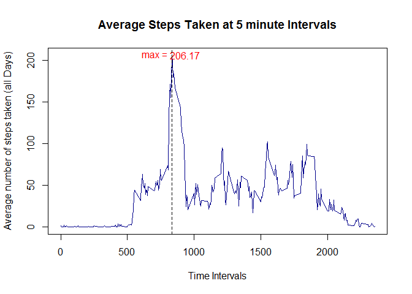
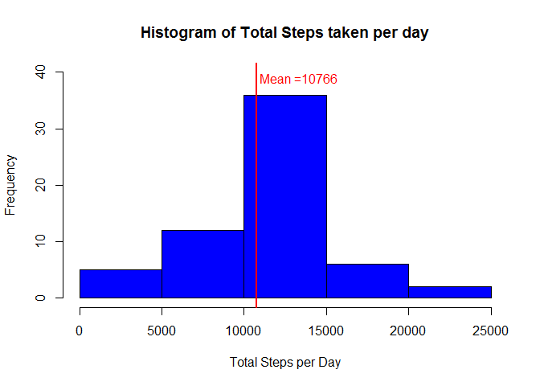
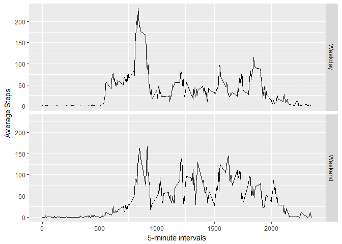

# Reproducible Research: Peer Assessment 1


## Loading and preprocessing the data
This assignment is to analyze the data obtained from a personal activity monitoring 
device. The data consists of two months of data from an anonymous individual collected 
during the months of October and November, 2012 and include the number of steps 
taken in 5 minute intervals each day.
The first step is to download the data from the link if the data is not available.

```r
setwd("D:/Documents/Data Science/Reproducible research/Week 2/RepData_PeerAssessment1")
fileUrl <- "https://d396qusza40orc.cloudfront.net/repdata%2Fdata%2Factivity.zip"
if(!file.exists("activity.zip")) download.file(fileUrl, destfile = "activity.zip")
```

Then the data is unzipped loaded into R.

```r
unzip("activity.zip")
activity <- read.csv("activity.csv", sep = ",", header = TRUE)
activity$date <- as.Date(activity$date, "%Y-%m-%d")
```

## What is mean total number of steps taken per day?

To obtain the mean of the total number of steps per day, first we compute the 
total steps in a day.

```r
step_date <- tapply(activity$steps, activity$date, sum)
```

A histogram is plotted to visualize the data. 

```r
hist(step_date, col = "grey", xlab = "Total Steps per Day", ylab = "Frequency", 
    main = "Histogram of Total Steps taken per day", ylim = c(0,30))
abline(v=mean(step_date, na.rm = TRUE), col="red", lwd=2)
text(12200, 29, labels = "Mean =", col="red")
text(14600, 29, labels = round(mean(step_date, na.rm = TRUE)),col= "red")
```

<!-- -->

The mean and median is then computed using the R codes below and presented in
Table 1 below.

```r
mean <- as.integer(mean(step_date, na.rm = TRUE))
median <- as.integer(median(step_date, na.rm = TRUE))
```


### Table 1

Statistical parameters   | Number of Steps per day
-------------| -------------
Mean         | 10766
Median       | 10765


## What is the average daily activity pattern?

To visualize the daily activity pattern, a line plot for the average steps taken
at 5-minute interval is plotted below.


```r
step_interval <- tapply(activity$steps, activity$interval, mean, na.rm=TRUE)
plot(names(step_interval), step_interval, type = "l", xlab = "Time Intervals", 
     ylab = "Average number of steps taken (all Days)", 
     main = "Average Steps Taken at 5 minute Intervals", col = "darkblue")
text(as.integer(names(which.max(step_interval)))+100, max(step_interval), 
     labels = round(max(step_interval), digits = 2), col = "red")
text(as.integer(names(which.max(step_interval)))-120, max(step_interval), 
     labels = "max = ", col = "red")
abline(v=as.integer(names(which.max(step_interval))), lty=2)
```

<!-- -->

### The maximum number of steps

```r
time_of_the_day <- names(which.max(step_interval))
number_of_5_min_interval <- as.vector(which.max(step_interval))
```
The maximum number of steps occurred at the **104**th 
5-minute interval, at **835** (24-hour clock).

## Imputing missing values

There are missing values in the original dataset, hence we need to check the 
number of missing values.

```r
number_NAs <- sum(is.na(activity))
```
The total number of missing values in the dataset is **2304**.

The next step is to fill in the missing values using the average interval value 
across all days.

```r
NA_indices <- which(is.na(activity))
impute_values <- step_interval[as.character(activity[NA_indices, 3])]
names(impute_values) <- NA_indices
activity_new <- activity
for (i in NA_indices) { activity_new$steps[i] = impute_values[as.character(i)]}
```

Checking whether all NAs are replaced with the mean values. 

```r
which(is.na(activity_new))
```

```
## integer(0)
```

Now we can plot the histogram of total steps taken per day with the new dataset. 

```r
total_steps_day <- tapply(activity_new$steps, activity$date, sum)
hist(total_steps_day, col = "blue", xlab = "Total Steps per Day", 
     ylab = "Frequency", main = "Histogram of Total Steps taken per day", 
     ylim = c(0,40))
abline(v=mean(total_steps_day), col="red", lwd=2)
text(12200, 39, labels = "Mean =", col="red")
text(14600, 39, labels = round(mean(total_steps_day)),col= "red")
```

<!-- -->

The mean and median of the data after removing NAs are listed in the table below.

```r
mean_new <- as.integer(mean(total_steps_day))
median_new <- as.integer(median(total_steps_day))
```

### Table 2

Statistical parameters   | Number of Steps per day
-------------| -------------
Mean         | 10766
Median       | 10766

It seem that the results are similar to the one with the old dataset. 

## Are there differences in activity patterns between weekdays and weekends?

A new factor variable are included in the dataset. The factor (day_type)has two 
levels - "weekday" and "weekend" are created in the new dataset (activity_new)
using the R codes below. This is to view if there are any differences between 
the activity patterns between weekdays and weekends.


```r
days <- weekdays(activity_new$date)
activity_new$day.type <- ifelse(days == "Saturday" | days == "Sunday", "Weekend", 
                                "Weekday")
average_steps <- aggregate(activity_new$steps, 
                           by=list(activity_new$interval, activity_new$day.type),
                           mean)
names(average_steps) <- c("interval", "day.type", "average.steps")
```

Making a panel plot containing a time series plot of the 5-minute interval 
(x-axis) and the average number of steps taken using the ggplot2 package.


```r
library(ggplot2)
g <- ggplot(average_steps, aes(interval, average.steps))
g+geom_line()+facet_grid(day.type~.)+labs(x="5-minute intervals")+
        labs(y="Average Steps")
```

<!-- -->
